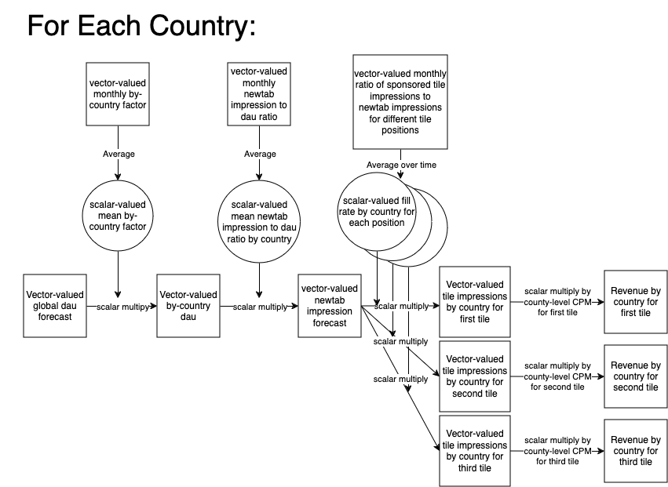

# Ads Tiles Revenue Forecast

## Overview
This flow forecasts the number of tiles available for desktop. Rather than forecasting everything on its own, it scales the KPI desktop DAU forecast to get the desired metrics. Specifically, the inventory forecast is combined with fill rates, to get future impressions. These are then used to produce revenue estimates.  There are three forecasted values created by this pipeline:

- `inventory_forecast`: Forecasted newtab inventory by month and country
- `expected_impressions`: the forecasted number of tile impressions
- `revenue`: the expected revenue

The output table is indexed by country, month (`submission_month`), and whether or not the revenue column represents including or excluding direct sales (indicated by the values `with_direct_sales` and `no_direct_sales`, repsectively, in the `forecast_type` column).

### `inventory_forecast` derivation

The forecast applies country-level factors to the DAU forecast.  In the code the data exists as a pandas dataframe where each row is uniquely identified by country and time (specifically, `submission_month`).  Throughout the code, country-level factors are joined on to this dataframe by country as new columns, which are multiplied to the DAU forecast elementwise.  One can think of the DAU forecast as a collection of independent timeseries for each country, where scalar factors are calculated and applied to the timeseries (see the diagram below).  The scalar factors are obtained by doing operations on country timeseries and aggregating over time to product country-level, scalar factors:

The idea behind the inventory forecast is to execute the following steps:
1. **get by-country dau forecast** The by-country dau forecast is obtained by multipling the global dau forecast by two scalar factors, a `share_by_market` factor and an `elgbility_factor`:
   - global dau forecast: The global dau forecast comes from the table `moz-fx-data-shared-prod.telemetry_derived.kpi_forecasts_v0`.  We use the monthly value, which is the cumulative DAU for the month.
   - `share_by_market`:  The purpose of this factor is to convert the global forcast to a by-country forecast.  It is derived by taking the monthly cumulative DAU from `moz-fx-data-shared-prod.telemetry.active_users_aggregates` for a given country and dividing it by the total across all countries, yielding the fraction of the total dau contributed by that country.  This is then averaged over the number of months of past data specified in `observed_months` in the config file to get a scalar value for each country.
   -  `elgibility_factor`: The elgibility is specified for each product (IE tiles) individually for mobile and desktop as a sql function in the config file for each flow.  It is determined by which app version that the product became available in each country.  The monthly cumulative number of eligibile, active users **within a country** is calculated using this function on `moz-fx-data-shared-prod.telemetry.active_users_aggregates`, and divided by the total number of active users **within a country** to get a monthly elgbility factor for that country.  These are then averaged over the number of months specified in `observed_months` in the config to get a scalar value for each country.
2. **turn country-level DAU into country-level newtab inventory by multiplying a scalar factor representing the ratio of the inventory to the dau by country**: The country-level newtab inventory by month is obtained from the table `newtab_clients_daily_aggregates`.  The count of newtab impressions and DAU are calculated by month and stored in `self.newtab_visits`.  The quotient is calculated and averaged by country to get a scalar factor, which is stored in `self.inventory_per_client`
3. **turn country-level DAU into country-level tile impressions by multiplying by scalar fill rate**: The fill rate is calculated from tile impressions and newtab impressions obtained from the table `moz-fx-data-shared-prod.contextual_services.event_aggregates_spons_tiles` and stored in `self.impressions`.  The quotient of tile impressions and newtab impressions is taken, imputed for new geos, and averaged by country to obtain scalar values that are stored in `self.fill_rate_by_country`
4. **turn county-level impressions into revenue by multiplying by CPM/1000**:  The CPMs are derived from config. Note that first two tiles have a different CPM than the third tile.  The CPMs are applied to the tile impressions and stored in `self.output_df` in the penultimate step.

## Output
The table currently writes to `moz-fx-data-shared-prod.ads_derived.tiles_monthly_v1`.  Only the Outerbounds service account `task-revenue@moz-fx-mfouterbounds-prod-f98d.iam.gserviceaccount.com` has permission to write, so it must be done there (see above on how to run in outerbounds).  This table is also used in the view which writes to `moz-fx-data-shared-prod.ads.tiles_monthly`.  The structure of the data is meant to match that of the AMP actuals data in `moz-fx-data-shared-prod.revenue.admarketplace`, making it easy to join the two sources.

Each row of thet table represents a specific tile position (indicated by `position`) for a specific product (Indicated by the value in the `product` column, IE `tiles` for desktop tiles allocated to AMP, `mobile tiles` for mobile tiles allocated to AMP, etc) on a specific month (indicated by `submission_month`) for a specific country (indicated by the `country code` column) for a specific forecast (indicated by the `forecast_month` column).  

The meanings of each column are as follows:
   - `position` (INTEGER): Tile position
   - `product` (STRING): indicates which "product" the row is associated with.  Currently only `tiles`, representing desktop tiles allocated to AMP, is supported
   - `submission_month` (DATETIME): monthy associated with the forecast.  Will always be the first day in the month.
   - `country_code` (STRING): two-letter country code
   - `forecast_month` (DATETIME):  Month that the forecast was generated
   - `direct_sales_included` (BOOLEAN): Indicates whether the allocation to direct sales is subtracted (True) or ignored (False)
   - `impressions` (FLOAT):  Predicted number of impressions, can be null when the pricing model is clicks
   - `clicks` (FLOAT):  Predicted number of clicks, can be null when the pricing model is impressions
   - `revenue` (FLOAT): Predicted revenue
   - `CPM` (FLOAT): rate used to calculate revenue
   - `device` (STRING):  indicates whether the forecast is for desktop or mobile.  Note this information is also captured in the `product` columne
   - `placement` (STRING):  placement of the ad, currently only `newtab`
   - `pricing_model` (STRING): Indicates whether clicks or impressions are used in the pricing model
   - `forecast_predicted_at` (TIMESTAMP):  Indentifies the DAU forecast used for this forecast

## History and Changes
This pipeline was derived from [this notebook](https://colab.research.google.com/drive/1qOsjCY8G6mM91FU3ZiOfsSZJRi5CpLOj).  The only major change is that the invenetory is now obtained from a derived table rather than from looker, the latter method is described in the notebook.  Other non-functional changes were made for readability and efficiancy.  The outputs of the flow were validated against the notebook outputs to be accurate to within 3%.

