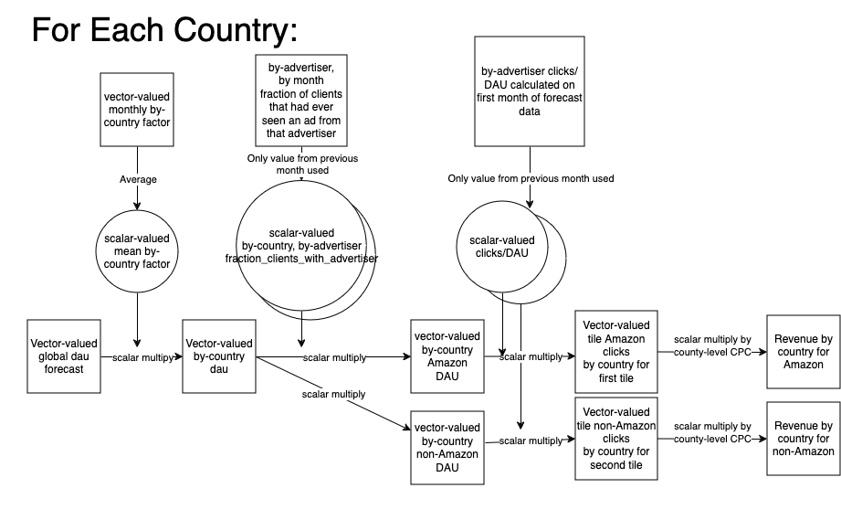

# Mobile Ads Tiles Revenue Forecast

## Overview
This flow forecasts the number of clicks and revenue on mobile, distinguishing between those from Amazon ads and those from other sources. Rather than forecasting everything on its own, it scales the KPI mobile DAU forecast to get the desired metrics. Specifically, the inventory forecast is combined with fill rates, to get future impressions. These are then used to produce revenue estimates.  There are three primary forecasted values for each ad source created by this pipeline:

- `dau_with_advertiser`:  forecasted daily active users for amazon and other ads
- `clicks`: Forecasted clicks for amazon and non-amazon ads
- `revenue`: the forecasted revenue of impressions

The output table is indexed by country, month (`submission_month`).

### `inventory_forecast` derivation
The idea behind the inventory forecast is to execute the following steps.  Note in the code they are also calculated by position,
but are aggregated before writing because the AMP table doesn't account for position.  Because it isn't salient to the output
that detail is ommited below.  Note also that "advertiser" refers to two cases, Amazon and non-Amazon advertisers.  The flow is visualized below:

1. **get by-country dau forecast** The by-country dau forecast is obtained by multipling the global dau forecast by two scalar factors, a `share_by_market` factor and an `elgbility_factor`:
   - global dau forecast: The global dau forecast comes from the table `moz-fx-data-shared-prod.telemetry_derived.kpi_forecasts_v0`.  We use the monthly value, which is the cumulative DAU for the month.
   - `share_by_market`:  The purpose of this factor is to convert the global forcast to a by-country forecast.  It is derived by taking the monthly cumulative DAU from `moz-fx-data-shared-prod.telemetry.active_users_aggregates` for a given country and dividing it by the total across all countries, yielding the fraction of the total dau contributed by that country.  This is then averaged over the number of months of past data specified in `observed_months` in the config file to get a scalar value for each country.
   -  `elgibility_factor`: The elgibility is specified for each product (IE tiles) individually for mobile and desktop as a sql function in the config file for each flow.  It is determined by which app version that the product became available in each country.  The monthly cumulative number of eligibile, active users **within a country** is calculated using this function on `moz-fx-data-shared-prod.telemetry.active_users_aggregates`, and divided by the total number of active users **within a country** to get a monthly elgbility factor for that country.  These are then averaged over the number of months specified in `observed_months` in the config to get a scalar value for each country.
2. **get by-country, by-advertiser DAU by multiplying by `fraction_clients_with_advertiser`**: `fraction_clients_with_advertiser` is the fraction of clients that have ***ever*** had an ad from that advertiser in the previous month.  We therefore do not expect it to sum to 1 over advertisers within a given month.  This is multiplied by dau to get the number of clients that have ever seen an ad from the advertiser.  This value is a forecasted value and is saved as `dau_with_advertiser`
3. **get by-country, by-advertiser clicks by multiplying `clicks_per_qdau`**:  `clicks_per_qdau` is the fraction of clicks for an advertiser divided by the first month of the dau forecast multiplied by `fraction_clients_with_advertiser` in the past month.  The dau forecast is run one month behind the current month to faciliate this.  If this a case of Chesterton's Fence there are some pretty messed up sheep in that paddock.   This is multiplied by `dau_with_advertiser` and is the forecasted clicks for that advertiser within a country and month.  This is saved as `clicks`.
4. **get by-county, by-advertiser revenue by multiplying by cpc**:  CPC for each country is specified in the config, and is multiplied by clicks to get the by-country, by-advertiser revenue, saved as `revenue`

## Output
The table currently writes to `moz-fx-data-shared-prod.ads_derived.tiles_monthly_v1`.  Only the Outerbounds service account `task-revenue@moz-fx-mfouterbounds-prod-f98d.iam.gserviceaccount.com` has permission to write, so it must be done there (see above on how to run in outerbounds).  This table is also used in the view which writes to `moz-fx-data-shared-prod.ads.tiles_monthly`.  The structure of the data is meant to match that of the AMP actuals data in `moz-fx-data-shared-prod.revenue.admarketplace`, making it easy to join the two sources.

Each row of thet table represents a specific tile position (indicated by `position`, but null for mobile) for a specific product (Indicated by the value in the `product` column, IE `tiles` for desktop tiles allocated to AMP, `mobile tiles` for mobile tiles allocated to AMP, etc) on a specific month (indicated by `submission_month`) for a specific country (indicated by the `country code` column) for a specific forecast (indicated by the `forecast_month` column).  

The meanings of each column are as follows:
   - `position` (INTEGER): Tile position
   - `product` (STRING): indicates which "product" the row is associated with.  Current possible values:
     -  `tile`, representing desktop tiles allocated to AMP.  Includes both scenarios where direct sales is ignored (`direct_sales_included` is false) and case where direct sales allocation is subtracted out (`direct_sales_included` is True)
     -  `tile direct sales` :  Impressions and revenue for direct sales
   - `submission_month` (DATETIME): monthy associated with the forecast.  Will always be the first day in the month.
   - `country_code` (STRING): two-letter country code
   - `forecast_month` (DATETIME):  Month that the forecast was generated
   - `direct_sales_included` (BOOLEAN): Indicates whether the allocation to direct sales is subtracted (True) or ignored (False).  Note that it is True when `product` is `tile direct sales`
   - `advertiser`: Amazon or Other
   - `impressions` (FLOAT):  Predicted number of impressions, can be null when the pricing model is clicks
   - `clicks` (FLOAT):  Predicted number of clicks, can be null when the pricing model is impressions
   - `revenue` (FLOAT): Predicted revenue
   - `CPM` (FLOAT): rate used to calculate revenue
   - `device` (STRING):  indicates whether the forecast is for desktop or mobile.  Note this information is also captured in the `product` columne
   - `placement` (STRING):  placement of the ad, currently only `newtab`
   - `pricing_model` (STRING): Indicates whether clicks or impressions are used in the pricing model
   - `forecast_predicted_at` (TIMESTAMP):  Indentifies the DAU forecast used for this forecast

## Scheduled Production Run
The monthly update it scheduled to run 1 AM UTC on the 3rd of every month. The deployment can be viewed in Outerbounds [here](https://ui.desertowl.obp.outerbounds.com/dashboard/flows/p/revenue/mobileadtilesforecast.prod.mobileadtilesforecastflow).  The deployment is updated automatically via the circleci job `update_mobile_tiles_scheduled_job` whenever a commit is made into main.

## History and Changes
This pipeline was derived from [this notebook](https://colab.research.google.com/drive/1qOsjCY8G6mM91FU3ZiOfsSZJRi5CpLOj).  Several major changes were made to the large query from the notebook, which is broken into several smaller queries here:
- Instead of using `mozfun.bits28.active_in_range(browser_dau.days_seen_bits, 0, 1)` applied to the unified_metrics table, the `daily_users` column from the `active_users_aggregates` table is used
- Originally the time period where tiles were experimental and rolled out to only 25% of the population is included.  This is removed here to simplify the query.  This also effects the filters that determine elgibility in the US, using the post-experiment date of Sept 20 2022 and Oct 4 2022 of Android and iOS respectively.