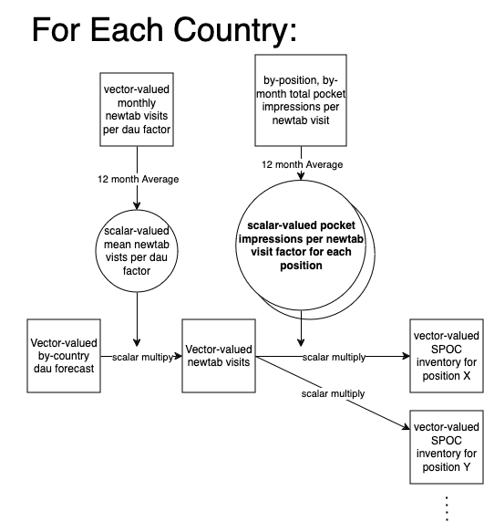

# Native Forecast

## Overview
This flow forecasts SPOC inventory, meaning the number of **total** (as oppposed to just sponsored) pocket impressions by tile.  This value is the maximum available number of impressions that could be sold as SPOCs.

The output table is indexed by country, month (`submission_month`), and position with the forecast in the `forecast_spoc_inventory` column

Currently the data only runs on Firefox desktop

### `inventory_forecast` derivation

The idea behind the inventory forecast is to execute the following steps. illustarted in the diagram above:
- **get by-country dau forecast**: This is done by running monthly cumulative DAU since 2019-01 through the darts `StatsForecastAutoARIMA` model by country.  The  `season_length` is set to 12 (to represent yearly seasonality) but all other parameters are set to the default values.  More details on this object can be found [here](https://unit8co.github.io/darts/generated_api/darts.models.forecasting.sf_auto_arima.html).
- **turn that into country-level newtab visits with sponsored stories by multiplying a factor representing the ratio of visits to the dau by country**: The country-level inventory by month is obtained from the `mozdata.telemetry.newtab_clients_daily` table.  Visits are counted by month and country when the `pocket_sponsored_stories_enabled` and `pocket_enabled` flags are true.  The ratio is calculated by month and rolled up to the country level by averaging over one year.  It is first stored in `self.impressions_to_newtab_with_spocs_factor["ratio_newtab_visits_with_spocpocket_to_dou"]`.
- **turn this into SPOC inventory by multiplying by a factor representing the number of impressions per newtab visit by position and country**: The by-country, by-position value is obtained from `mozdata.telemetry.newtab_visits`.  Visits are counted by position, month and country when the `pocket_sponsored_stories_enabled` and `pocket_enabled` flags are true. It is averaged over 12 months.  It is stored in `self.spocs_to_newtab_visits_factor["ratio_pocket_impressions_to_newtab_visits"]`

## History and Changes
Code was updated to calculate SPOC inventory by position.

This pipeline was derived from [this notebook](https://colab.research.google.com/drive/1zP1e02wp-ufv0lAR0PdUddILwF-9k-YI#scrollTo=SW7oxckRn0ov).  The notebook uses tables associated with deprecated PingCentre data, which was replaced in this code with data from the Newtab tables.